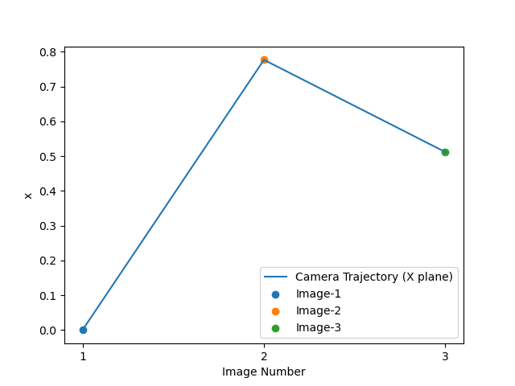
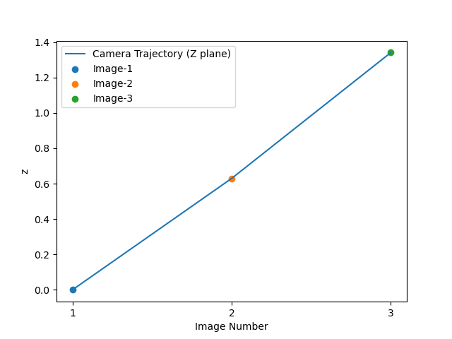

To run:
```
python main.py <number_of_images>
```
For this case <number_of_images> shall be 3. 

Results:

Whole trajectory of camera:

Whole trajectory of camera w.r.t x-axis:

Whole trajectory of camera w.r.t y-axis:

Whole trajectory of camera w.r.t z-axis:

